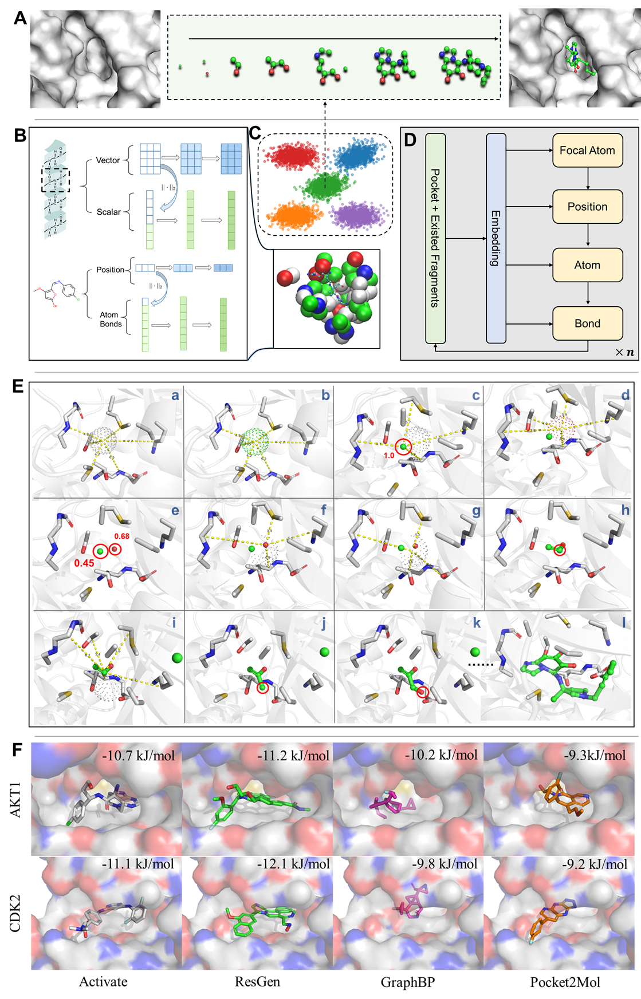
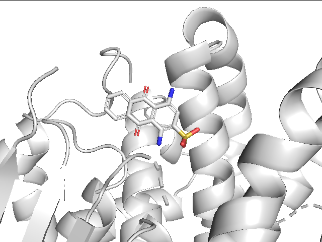

:loudspeaker: ResGen: A Pocket-aware 3D Molecular Generation Model Based on Parallel Multi-scale Modeling
=======
ResGen: A Pocket-aware 3D Molecular Generation Model Based on Parallel Multi-scale Modeling
<div align=center>

</div>
ResGen is the newly developed method for 3D pocket-aware molecular generation. 

## Environment 

### Install via conda yaml file (cuda 11.3)

```python
mamba env create -f resgen.yml
mamba activate resgen 
```

### Install manually 

(we recommend using mamba instead of conda, if you're old school, just change the mamba with conda)

```
mamba create -n resgen python=3.8
mamba install pytorch==1.10.1 cudatoolkit=11.3 -c pytorch -c conda-forge
mamba install pyg -c pyg
mamba install -c conda-forge rdkit
mamba install biopython -c conda-forge
mamba install pyyaml easydict python-lmdb -c conda-forge
```


## Data 

The main data for training is CrossDock2020, which is utilized by most of the methods. 

**Note: data is only necessary for training. For use-only mode, please directly check the generation part.**  

#### (Optional) Download the data from the original source

```python
wget https://bits.csb.pitt.edu/files/crossdock2020/CrossDocked2020_v1.1.tgz -P data/crossdock2020/
tar -C data/crossdock2020/ -xzf data/crossdock2020/CrossDocked2020_v1.1.tgz
wget https://bits.csb.pitt.edu/files/it2_tt_0_lowrmsd_mols_train0_fixed.types -P data/crossdock2020/
wget https://bits.csb.pitt.edu/files/it2_tt_0_lowrmsd_mols_test0_fixed.types -P data/crossdock2020/
```

The storage size of original crossdock2020 is 50 GB, hard to download and unzip. You can skip to the Approach 1 or Approach 2 for training preparation. 

#### Approach 1: Download the Pocket Data for Processing

You can download the processed data from [this link](https://drive.google.com/drive/folders/1CzwxmTpjbrt83z_wBzcQncq84OVDPurM). This is the processed version of original files, which is processed by [Luoshi Tong](https://github.com/luost26/3D-Generative-SBDD/tree/main/data).

Note: [index.pkl](https://github.com/HaotianZhangAI4Science/ResGen/tree/main/data/crossdocked_pocket10),  [split_by_name.pt](https://github.com/HaotianZhangAI4Science/ResGen/tree/main/data). are automatically downloaded with the SurfGen code.  index.pkl saves the information of each protein-ligand pair, while split_by_name.pt save the train-test split of the dataset.

```python
tar -xzvf crossdocked_pocket10.tar.gz
python process_data.py --raw_data ./data/crossdocked_pocket10 
```

#### Approach 2: Download the Processed Data

or you can download the processed data [lmdb](https://drive.google.com/file/d/1Cfr6DRl6U4RlrbX3b5Q1eg4syWfFD1uS/view?usp=share_link), [key](https://drive.google.com/file/d/1C5baYF06_iGBXYLLEu45JqVL9vPf1mwH/view?usp=sharing), and [name2id](https://drive.google.com/file/d/1TfFjfBebakUBE-GVnxUKAZuKK5zRlEEW/view?usp=sharing). 


# Generation

The trained model's parameters could be downloaded [here](https://drive.google.com/file/d/1bUBNDNc0ZzcG4WgY18aQB0PEVOO6RRQQ/view?usp=share_link).  

```python
python gen.py --pdb_file ./examples/4iiy.pdb --sdf_file ./examples/4iiy_ligand.sdf --outdir ./examples
```

You can also follow the guide at generation/generation.ipynb 

We provide the pdbid-14gs as the example

<div align=center>

</div>


# Training 

The training process is released as train.py, the following command is an example of how to train a model.

```python
python train.py --config ./configs/train_res.yml --logdir logs
```


# Acknowledge

This project draws in part from [GraphBP](https://github.com/divelab/GraphBP) and [Pocket2Mol](https://github.com/pengxingang/Pocket2Mol), supported by GPL-v3 License and MIT License. Thanks for their great work and code, hope readers of interest could check their work, too.  


